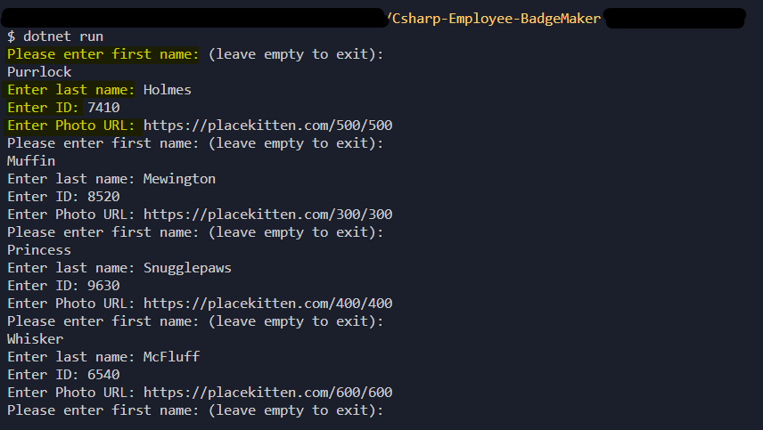
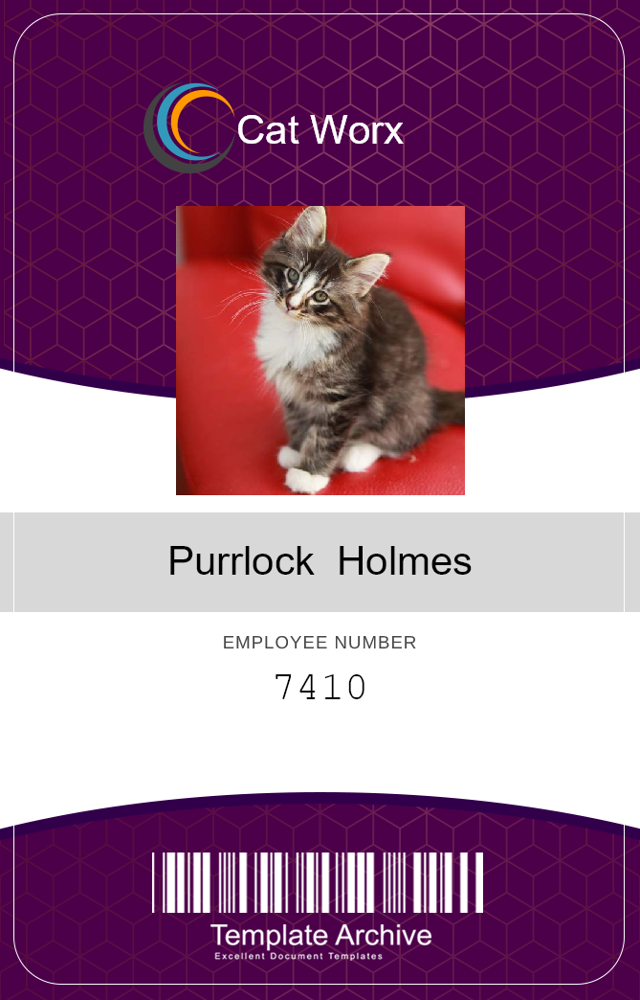
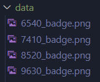
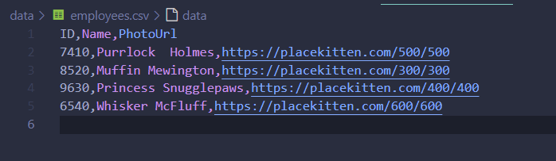

# Csharp-Employee-BadgeMaker
>.NET command line application  

Console app that creates employee security badges.  This application is developed using C# and .NET framework to import libraries that let you read and write to the file system, query APIs, and generate images.

 [](https://opensource.org/licenses/MIT) </br>
 


## Table of Contents
- [Getting Started](#getting-started) 
- [Screenshots](#screenshots)   
- [APIs](#apis) 
- [License](#license)
- [Contribute](#contribute)
- [Contact](#contact)


## Getting Started
To contribute, run or explore the codebase for this C# command line application, follow these steps below:

1. Clone the repository: `git clone https://github.com/CypherNyx/Csharp-Employee-BadgeMaker.git`
2. Open the project in VS Code (or a compatible IDE).
3. Navigate to the cloned directory in your file explorer. 
4. Enter the following in the Command Prompt to run the application:
```
dotnet run
```
5. Make changes or improvements as needed.
6. Additional notes: 
    - **Prerequisites**: Ensure you have .NET Core SDK (or the appropriate .NET Framework version) installed on your machine. You can download it from https://dotnet.microsoft.com/download.
    - **Exploring the code**: The main C# code files will be found in the Program.cs file within the src directory.


<br>

## Screenshots
### Data Input
Run the application and create a single employee (or multiple employees) at the command prompt to create a badge image. Don't forget to include the URL for the employee test photo, you can use the a place holder URL as https://placekitten.com/400/400 :



### Badge Preview
You'll find your new badges neatly saved as PNG files within the `data` folder. They'll look just like this:



###  Individual Badge Files:
Every employee will have their own unique badge, saved as a separate PNG file within the `data` folder. This makes it super easy to share, print, or use each badge individually.



### Consolidated Employee Data:
To keep track of all employee information in one place, inside the `data` folder, you'll also find a handy CSV file named `employee.csv`. This file stores employee details in a clear, organized format.



## APIs 
The application utilizes the following APIs:
* [Random User API](https://randomuser.me/)

## Contributing
Pull requests are welcome. Please open an issue first to discuss any proposed changes or additions.
<br>

## License
[](https://opensource.org/licenses/MIT)
  
  https://opensource.org/licenses/MIT <br> 
  This project is open source and available under the MIT License.

<br>

  ## Questions
  GitHub [CypherNyx](https://github.com/CypherNyx)<br>
  Email: <a href="mailto: dguido.dev@gmail.com" target="_blank">dguido.dev@gmail.com</a>
